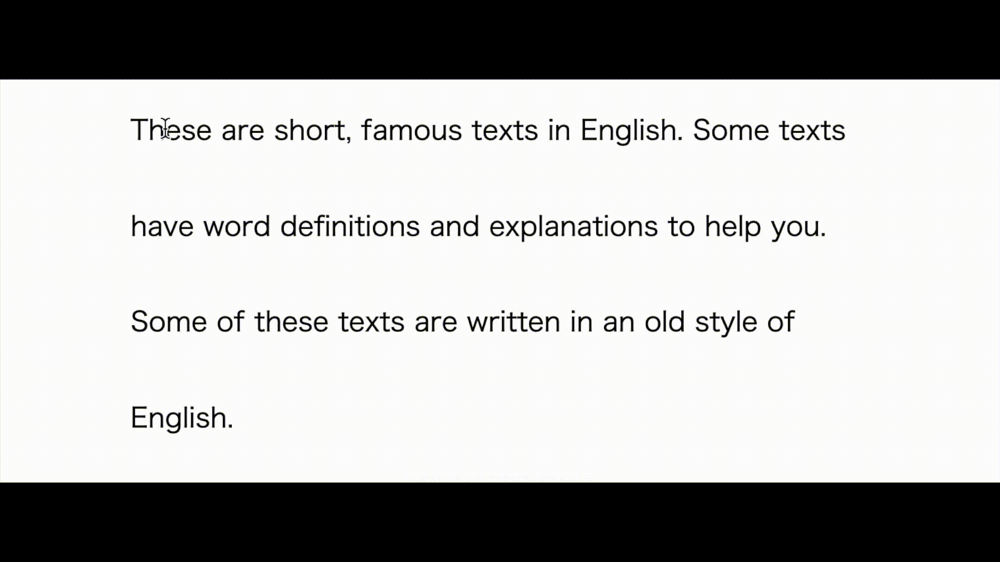

# marken

Marken is an attempt to apply the theory of "意味順", The Order of Meanings, to English reading comprehension.

## Demo

https://t-cool.github.io/marken

## Usage

After selecting the English text with the cursor, press the following key to add a symbol.

| Key | Meaning |
----|---- 
| A | Who(What) |
| S | Do(Is) |
| D | Whom / What |
| F | Where / When / How / Why (Adverbial phrases and clauses)|
| G | Adjective Phrase or Clause |
| Z | α(Tamatebako) |

The following additional commands are also available.

| Command | Purpose |
----|---- 
| Ctrl(Cmd)+Z | Undo |
| Ctrl(Cmd)+Y | Redo |
| Double-click on an element with the symbol | Put a note |

## License

The GNU General Public License v3.0
